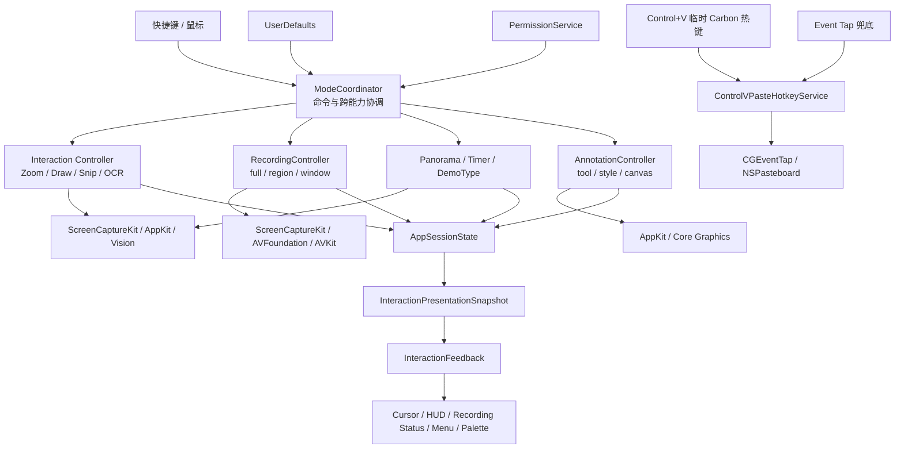

# DoraZoom 技术架构

> 状态：Phase 1–6 模拟实现与非侵入门禁已完成；Phase 7 已改为本地模拟验收  
> 产品需求：[PRD.md](./PRD.md)  
> 上游仓库：Microsoft `ZoomitForMac`  
> 评审基线：`b03e43da91cd84eeb8f691fa65095e0304c3e660`（2026-07-23）

## 1. 结论

DoraZoom 采用：

**Swift 6 + AppKit-first + ScreenCaptureKit + AVFoundation + Vision + SwiftPM，单进程、单核心模块、零第三方运行时依赖。**

保留微软官方源码的总体结构，在同一个 Swift Package 模块内增加少量边界清晰的适配组件，不重写捕获、绘画、录制、编辑和全景引擎。

最重要的架构改造不是增加新框架，而是把可并存状态和呈现状态明确分开：

- `ModeCoordinator` 协调命令和跨能力转换，但不复制各控制器的权威状态。
- `AppSessionState` 组合交互、录制、标注和画布背景这四个正交维度，不再用单一互斥 `AppMode` 描述全部运行状态。
- `InteractionPresentationSnapshot` 是各权威状态派生出的不可变呈现快照。
- `InteractionFeedback` 只负责光标、HUD、录制状态、菜单栏和临时工具条，并按反馈通道独立管理生命周期。
- `ControlVPasteHotkeyService` 通过截图后临时注册的 Carbon 热键处理主路径，`PasteCompatibilityService` / Event Tap 只保留为已具备监听权限时的兜底路径。
- `RecordingOutputStrategy` 统一 MOV、MP4 与 GIF 的输出管线；电影配置集中在 `MovieRecordingProfile`。
- `DrawingShortcutPolicy` 统一 `W/K`、颜色键与工具选择语义。

## 2. 架构图



依赖方向：

1. 输入产生 `AppCommand`。
2. `ModeCoordinator` 路由命令并协调跨能力转换。
3. 功能控制器各自拥有捕获、绘制、录制、OCR 和媒体处理的权威状态。
4. `AppSessionState` 只组合这些状态；`InteractionPresentationSnapshot` 只从它派生，不反向改变业务。
5. 平台服务封装 macOS API。
6. `InteractionFeedback` 接收不可变呈现描述，但无权启动或停止功能。

## 3. 评审边界

本文评审并设计以下边界：

- 微软官方 `ZoomItMacCore` 到 DoraZoom 定制需求之间的边界。
- 全局输入、模式协调、功能控制器和界面反馈之间的依赖方向。
- 光标、截图提示、录制状态和菜单栏状态的统一方式。
- `Control+V` 临时兼容与普通全局快捷键之间的边界。
- MOV、MP4 电影管线与 GIF 图像序列管线之间的策略边界。
- 权限、签名和个人版应用身份的运行时约束。
- Windows 功能语义与官方 Mac 实现差异的落点。

本文不重新设计 ZoomIt 的算法，也不以文件长度为理由机械拆分模块。

产品裁决顺序只在 `PRD.md` 第 0 节定义。本架构必须实现该顺序，不另设一套优先级；锁定的官方 Mac 提交是实现基线，不是覆盖 DoraZoom 产品决策的产品事实源。

## 4. 评审视角

采用以下六个架构视角：

1. **业务适配**：完整保留 ZoomIt，同时满足 Mac 粘贴、MOV、光标和权限体验。
2. **边界与所有权**：每个交互维度、录制生命周期、反馈通道、权限和媒体配置必须有唯一所有者。
3. **依赖方向**：产品策略不能散落在捕获、绘制和窗口实现中。
4. **模块深度**：新模块必须隐藏真实复杂度，不能只是转发调用。
5. **变更放大**：微软上游更新时，DoraZoom 差异不应造成大面积合并冲突。
6. **生命周期正确性**：模式进入、退出、权限回调、录制停止和异步任务必须保持一致。

## 5. 技术栈

| 领域 | 技术 | 决策 |
| --- | --- | --- |
| 语言 | Swift 6、Strict Concurrency | 沿用官方 |
| 覆盖层、光标、菜单栏 | AppKit、Core Animation、Core Graphics | 核心选择 |
| 设置窗口 | AppKit、`NSSplitViewController` | 暂不引入 SwiftUI |
| 屏幕捕获 | ScreenCaptureKit | 沿用官方 |
| 电影录制 | AVFoundation、CoreMedia | 沿用，增加 MOV/MP4 Profile |
| GIF 导出 | ImageIO、Core Graphics | 独立图像序列输出，不伪装成视频容器 |
| 视频预览与编辑 | AVKit、AVFoundation | 沿用官方 |
| OCR | Vision | 完全本地 |
| 全局快捷键 | Carbon `RegisterEventHotKey` | 沿用官方 |
| `Control+V` 兼容 | Carbon 临时热键；Core Graphics `CGEventTap` 兜底 | 独立动态服务 |
| 剪贴板 | `NSPasteboard` | 原生 |
| 权限 | TCC、CoreGraphics、AVFoundation | 按需申请 |
| 登录时启动 | ServiceManagement | 沿用官方 |
| 设置存储 | `UserDefaults` | 不引入数据库 |
| 本地诊断 | `os.Logger`、Signpost | 不做遥测 |
| 构建 | Swift Package Manager、App Bundle 脚本 | 不要求第三方构建系统 |
| 分发 | 稳定签名、日常/调试双 Bundle ID、可选 DMG | 满足个人版且隔离权限 |

### 5.1 为什么 AppKit-first

DoraZoom 的核心能力依赖：

- 无边框全屏窗口。
- 精确窗口层级。
- `NSCursor`。
- 鼠标追踪与全局事件。
- 窗口捕获排除。
- 自定义绘制。
- 菜单栏应用生命周期。

这些能力最终都需要 AppKit。官方源码当前也使用 AppKit 组装应用、菜单栏、覆盖窗口和设置页面。

仅为设置页面引入 SwiftUI 会形成两套状态和窗口生命周期，不值得。未来如果完整重写设置页面，可以把 SwiftUI 限定为不参与核心模式的叶子节点。

### 5.2 不采用的技术

- **Electron/Tauri**：增加运行时、包体和输入延迟，macOS 捕获与权限仍需原生桥接。
- **FFmpeg**：AVFoundation 已能处理 MOV、H.264 和 AAC，引入 FFmpeg 会产生重复媒体管线和额外分发成本。
- **Metal 自研渲染器**：现阶段 AppKit/Core Graphics 足够；只有性能测量证明绘制瓶颈后再考虑。
- **RxSwift 或状态框架**：Swift Concurrency、闭包和明确的状态对象已经足够。
- **数据库**：个人版设置适合 `UserDefaults`，截图和录制不需要业务数据模型。
- **自动更新框架**：个人版暂无自动更新需求。
- **依赖注入框架**：官方已在 `AppDelegate` 中进行清晰的手工组装。

## 6. 当前架构中应保留的部分

### 6.1 Swift Package 边界

官方 Package 当前包含：

- `ZoomItMacCore` library。
- `ZoomIt` executable。
- `ZoomItMacSelfTest` executable。
- macOS 14 最低版本。
- Swift 6 Strict Concurrency。
- 无第三方 package 声明。

证据：[`Package.swift:1-53`](https://github.com/microsoft/ZoomitForMac/blob/b03e43da91cd84eeb8f691fa65095e0304c3e660/Package.swift#L1-L53)。

该边界适合 DoraZoom，应继续保留。

### 6.2 手工依赖组装

官方在 `AppDelegate` 中创建设置、权限、显示器、捕获、覆盖层、标注、视口、模式协调和快捷键服务，然后将命令送入 `ModeCoordinator`。

证据：[`AppDelegate.swift:20-78`](https://github.com/microsoft/ZoomitForMac/blob/b03e43da91cd84eeb8f691fa65095e0304c3e660/Sources/ZoomItMacCore/App/AppDelegate.swift#L20-L78)。

该方式简单、可读、没有运行时反射，适合继续使用。

### 6.3 模式协调

`ModeCoordinator` 已经拥有当前 `AppMode`，并统一处理 Zoom、绘画、截图、OCR、录制、全景、DemoType 和计时器命令。

证据：[`ModeCoordinator.swift:4-53`](https://github.com/microsoft/ZoomitForMac/blob/b03e43da91cd84eeb8f691fa65095e0304c3e660/Sources/ZoomItMacCore/Core/ModeCoordinator.swift#L4-L53)、[`ModeCoordinator.swift:73-161`](https://github.com/microsoft/ZoomitForMac/blob/b03e43da91cd84eeb8f691fa65095e0304c3e660/Sources/ZoomItMacCore/Core/ModeCoordinator.swift#L73-L161)。

官方的单一 `AppMode` 可以继续承担互斥交互入口，但不能直接扩展为 DoraZoom 的全部会话状态。录制可以与绘画、白板和摄像头画中画并存；若把它们塞进一个枚举，就会产生组合爆炸或错误互斥。

DoraZoom 保留 `ModeCoordinator` 作为命令协调中心，但权威状态按下表归属：

| 状态 | 唯一所有者 |
| --- | --- |
| 当前互斥交互（缩放、选区、OCR、全景、DemoType、计时） | `ModeCoordinator`；对应控制器只拥有平台资源 |
| 录制生命周期、目标和时长 | `RecordingController` |
| 当前标注工具、颜色、粗细和高亮 | `AnnotationController` |
| 白板、黑板或透明画布背景 | `AnnotationController` |
| 光标、HUD、菜单栏、状态胶囊和工具条呈现 | `InteractionFeedback`，只持有呈现资源 |
| 剪贴板武装状态与 `Control+V` 转换 | `PasteCompatibilityService` |

`ModeCoordinator` 读取或订阅这些状态以即时组装 `AppSessionState`，该值不作为另一份持久状态保存；协调器不能在内部维护不同步的录制或标注副本。

### 6.4 平台服务协议

官方已经通过 `PermissionService` 隔离权限状态、请求和系统设置入口。

证据：[`PermissionService.swift:19-29`](https://github.com/microsoft/ZoomitForMac/blob/b03e43da91cd84eeb8f691fa65095e0304c3e660/Sources/ZoomItMacCore/Permissions/PermissionService.swift#L19-L29)。

新的键盘事件监听与发送权限应延续这一方向，避免在 UI 或粘贴逻辑中直接散布 TCC 判断。

### 6.5 会话状态与呈现快照

实现前先建立最小组合状态，名称可以随上游类型调整，但四个维度不能重新合并为单一互斥枚举：

```swift
struct AppSessionState: Equatable, Sendable {
    let interaction: InteractionState
    let recording: RecordingState
    let annotation: AnnotationState
    let canvas: CanvasBackground
}
```

允许的典型组合包括：

- `recording + drawing`
- `recording + whiteboard`
- `recording + drawing + webcam`
- `regionSelection + notRecording`

`InteractionPresentationSnapshot` 从 `AppSessionState` 和权限状态单向派生，至少包含 pointer、transient HUD、recording status、menu bar 和 palette 五个通道。它不保存捕获会话、媒体 writer、撤销栈或业务命令。

### 6.6 完整能力落点

| 产品能力 | 主要实现落点 | DoraZoom 改造 |
| --- | --- | --- |
| 静态/实时缩放、原比例/实时绘画 | 上游 `ModeCoordinator`、Overlay、Canvas | 接入组合状态与反馈快照，不重写算法 |
| 画笔、形状、高亮、文字、撤销、清除 | 上游 Canvas / Annotation | 接入 `DrawingShortcutPolicy` 和工具呈现 |
| 白板、黑板、白色/黑色画笔 | 上游 Annotation | `W/K` 改为画布背景；两种画笔留在颜色选择 |
| 截图到剪贴板/文件、OCR | 上游 Snip、Vision、`NSPasteboard` | 截图成功后武装粘贴兼容并按需申请权限 |
| 全屏、区域、窗口录制 | 上游 Recording + `RecordingTarget` | 补齐窗口目标并统一选择反馈 |
| MOV、MP4 | AVFoundation 电影管线 | MOV 为默认，`MovieRecordingProfile` 保证容器与扩展名一致 |
| GIF | ImageIO 图像序列管线 | 保留独立导出，不经过电影 writer |
| 系统声音、麦克风、摄像头画中画 | 上游 Recording / Webcam | 保持与绘画、白板并存，状态进入组合快照 |
| 录制预览、裁剪、拼接、淡入淡出、音量和导出 | 上游 Editor | 只适配输出策略，不删减编辑能力 |
| 倒计时、DemoType、全景 | 上游对应控制器 | 接入通道化反馈与 session 校验 |
| 快捷键自定义、设置、单实例、登录启动 | 上游 App / Settings / Hotkeys | 保持上游能力，增加个人版身份和权限状态 |
| `Command+V` / `Control+V` | 系统原生粘贴 / `PasteCompatibilityService` | 原生路径始终保留，兼容路径有条件启用 |

## 7. 复杂度中心

最危险的复杂度不是 ScreenCaptureKit 或 AVFoundation 本身，而是：

**多个可并存业务状态，与光标、HUD、录制胶囊、菜单栏和临时窗口生命周期之间的同步，可能逐渐分散到不同控制器。**

当前证据：

- `ModeCoordinator` 通过单独闭包通知录制状态。
- `AppDelegate` 根据闭包更新菜单栏图标。
- `ZoomCanvasView` 自己隐藏和恢复系统光标。
- `SnipController` 自己 push、set、pop 十字光标。
- `RecordingController` 和 `PanoramaController` 分别持有选择光标 lease。
- 多个控制器分别设置临时窗口的 `sharingType`。

涉及位置：

- [`AppDelegate.swift:74-77`](https://github.com/microsoft/ZoomitForMac/blob/b03e43da91cd84eeb8f691fa65095e0304c3e660/Sources/ZoomItMacCore/App/AppDelegate.swift#L74-L77)
- [`SnipController.swift:11-55`](https://github.com/microsoft/ZoomitForMac/blob/b03e43da91cd84eeb8f691fa65095e0304c3e660/Sources/ZoomItMacCore/Capture/SnipController.swift#L11-L55)
- [`ZoomCanvasView.swift:694-702`](https://github.com/microsoft/ZoomitForMac/blob/b03e43da91cd84eeb8f691fa65095e0304c3e660/Sources/ZoomItMacCore/Overlay/ZoomCanvasView.swift#L694-L702)
- [`RecordingController.swift:1210-1223`](https://github.com/microsoft/ZoomitForMac/blob/b03e43da91cd84eeb8f691fa65095e0304c3e660/Sources/ZoomItMacCore/Capture/RecordingController.swift#L1210-L1223)
- [`PanoramaController.swift:167-180`](https://github.com/microsoft/ZoomitForMac/blob/b03e43da91cd84eeb8f691fa65095e0304c3e660/Sources/ZoomItMacCore/Capture/PanoramaController.swift#L167-L180)

如果在这些位置分别增加彩色画笔光标、OCR 标志、录制胶囊、白板反馈和工具条，会产生：

- 一种新状态需要修改多个模块。
- 模式、光标、HUD 和菜单栏可能不同步。
- 异常退出时可能遗漏 cursor pop 或临时窗口关闭。
- 结束绘画反馈时可能误清理仍在进行的录制状态。
- 微软上游修改相同控制器时产生高频合并冲突。

因此，统一反馈边界是最高杠杆的架构工作。

## 8. 方案比较

| 方案 | 初始成本 | 上游合并 | 边界清晰度 | 长期复杂度 | 判断 |
| --- | ---: | ---: | ---: | ---: | --- |
| A. 直接修改官方各控制器 | 最低 | 差 | 低 | 高 | 不推荐 |
| B. 同一模块增加薄适配层 | 低 | 好 | 高 | 低 | 推荐 |
| C. 拆成多个 Swift Package 或插件 | 高 | 一般 | 表面清晰 | 高 | 过度设计 |

### 8.1 方案 A：直接修改

优点：

- 最快看到结果。
- 新文件最少。

问题：

- 产品差异散落在官方核心文件。
- 光标、权限、粘贴、媒体格式相互污染。
- 上游合并时冲突最多。

### 8.2 方案 B：薄适配层

在 `ZoomItMacCore` 同一 target 中增加：

- `AppSessionState` 与 `InteractionPresentationSnapshot`。
- `InteractionFeedback`。
- `PasteCompatibilityService`。
- `RecordingOutputStrategy` 与 `MovieRecordingProfile`。
- `DrawingShortcutPolicy`。
- 必要的权限适配。

优点：

- 不创建新的 package API。
- 定制逻辑集中。
- 官方捕获与绘画代码保持稳定。
- 上游合并冲突可控。

这是推荐方案。

### 8.3 方案 C：多 Package

可以拆成 `UpstreamCore`、`DoraCore`、`PlatformAdapters` 等包。

不推荐原因：

- 官方内部类型目前不是稳定公开 API。
- 强制拆包会迫使大量类型变成 `public`。
- 增加接口数量和跨包跳转。
- 对个人版没有足够收益。

## 9. 推荐模块

### 9.1 `InteractionFeedback`

职责：

- 自定义 `NSCursor` 的创建、隐藏、恢复和热点。
- 截图、OCR、录制和全景选择反馈。
- 完成 Toast。
- 录制状态胶囊。
- 菜单栏状态。
- 临时绘画工具条。
- 浅色、深色、高对比度和减弱动态。
- 临时窗口的捕获排除。

建议接口：

```swift
enum FeedbackChannel: Hashable, Sendable {
    case pointer
    case transientHUD
    case recordingStatus
    case menuBar
    case toolPalette
}

protocol InteractionFeedback {
    @MainActor
    func begin(
        _ presentation: FeedbackPresentation,
        on channel: FeedbackChannel
    ) -> FeedbackLease
}

protocol FeedbackLease: AnyObject {
    @MainActor
    func update(_ presentation: FeedbackPresentation)

    @MainActor
    func end()
}
```

原则：

- 每个 lease 只拥有一个反馈通道；结束时只恢复该通道的上一个有效呈现并关闭该通道的临时资源。
- 不同通道可以并存。绘画切换 pointer 或 tool palette 时，不得清除 recording status 或 menu bar。
- 同一通道的新 lease 取代旧 lease 后，旧 lease 的迟到 `end()` 不得清除新呈现。
- 重复 `end()` 应安全无副作用。
- 模块不得发送 `AppCommand`。
- 模块不得启动或停止捕获与录制。
- 模块只呈现状态，不拥有业务模式。

为什么不只增加一个 `CursorManager`：

光标、HUD、菜单栏和捕获排除共享资源管理规则，但并不共享同一个互斥生命周期。通道化 lease 同时隐藏 AppKit 资源细节并保留录制与绘画并行能力；只统一光标会留下另一半同步问题，形成浅模块。

### 9.2 `PasteCompatibilityService`

现有 `HotkeyService` 负责固定全局快捷键；`Control+V` 只在 DoraZoom 截图仍位于剪贴板时临时注册，生命周期不同，必须独立。

建议接口：

```swift
protocol PasteCompatibilityService {
    func arm(pasteboardChangeCount: Int) -> PasteArmResult
    func disarm()
}
```

内部规则：

- 只有最近一次剪贴板内容来自 DoraZoom 时注册 Carbon `Control+V` 热键。
- 其他时间撤销临时热键；剪贴板 `changeCount` 变化后最多 250 ms 内撤销。
- 只转换精确的 `Control+V`。
- 合成事件携带内部标记，避免递归处理。
- 剪贴板 `changeCount` 改变后立即失效。
- Carbon 回调和 Event Tap 回调都不执行 UI、媒体或文件操作。
- 主路径只用 `CGPreflightPostEventAccess()` / `CGRequestPostEventAccess()` 检查并请求发送权限，不要求 Input Monitoring，也不读取用户按键内容。
- 已同时具备 listen/post 权限时可以启用 Event Tap 兜底；缺少 listen 权限不影响 Carbon 主路径。
- 首次截图成功后，调用方先展示用途说明，再请求发送权限；不能等待第一次 `Control+V` 后才请求。
- 权限拒绝或尚未授权时，服务不拦截任何事件，原生 `Command+V` 路径保持不变。
- 授权后，只要同一个 `pasteboardChangeCount` 仍有效，精确 `Control+V` 可以重复转换；转换本身不解除 armed 状态。

为什么不并入 `HotkeyService`：

固定功能热键与截图后临时存在的粘贴热键具有不同的状态源和生命周期；独立服务可以在剪贴板变化时立即撤销，而不重载全部产品热键。

### 9.3 `RecordingOutputStrategy`

官方当前在 `RecordingEngine` 中直接指定 `.mp4`、H.264 和 AAC 参数，并在临时文件名中再次写入 `.mp4`。

证据：

- [`RecordingController.swift:26-85`](https://github.com/microsoft/ZoomitForMac/blob/b03e43da91cd84eeb8f691fa65095e0304c3e660/Sources/ZoomItMacCore/Capture/RecordingController.swift#L26-L85)
- [`RecordingController.swift:860-912`](https://github.com/microsoft/ZoomitForMac/blob/b03e43da91cd84eeb8f691fa65095e0304c3e660/Sources/ZoomItMacCore/Capture/RecordingController.swift#L860-L912)

建议：

```swift
enum RecordingTarget: Equatable, Sendable {
    case fullDisplay
    case region
    case windowUnderPointer
}

enum RecordingOutputStrategy: Equatable, Sendable {
    case movie(MovieRecordingProfile)
    case gif(GIFRecordingProfile)
}

struct MovieRecordingProfile: Equatable, Sendable {
    let fileType: AVFileType
    let fileExtension: String
    let videoCodec: AVVideoCodecType
    let audioSampleRate: Double
    let audioBitRate: Int
    let audioChannelCount: Int
}
```

DoraZoom 默认值：

```swift
RecordingOutputStrategy.movie(
    MovieRecordingProfile(
        fileType: .quickTimeMovie,
        fileExtension: "mov",
        videoCodec: .h264,
        audioSampleRate: 48_000,
        audioBitRate: 128_000,
        audioChannelCount: 2
    )
)
```

录制请求必须显式携带一个 `RecordingTarget` 和一个 `RecordingOutputStrategy`。全屏、区域、鼠标所在窗口是目标维度；MOV、MP4、GIF 是输出维度，两者不能混成一个枚举。

MOV 和 MP4 共用 AVFoundation 电影管线，由 `MovieRecordingProfile` 统一约束录制引擎、临时文件、保存面板和编辑器。GIF 通过 ImageIO/Core Graphics 的图像序列管线导出，不传入 `AVAssetWriter`，不承诺音轨；官方已有的 GIF 用户能力必须保留。

为什么不直接把 `.mp4` 全局替换为 `.mov`：

文件类型、扩展名、保存面板、编辑器导出和追加流程必须保持一致。机械替换容易漏掉某一处，产生无法打开或无法追加的文件。

### 9.4 `DrawingShortcutPolicy`

官方 Mac 与 Windows ZoomIt 的 `W/K` 语义存在差异，因此快捷键裁决不能散落在键盘事件分支中。

```swift
enum DrawingShortcut: Equatable, Sendable {
    case character(Character)
}

struct DrawingShortcutPolicy: Equatable, Sendable {
    let whiteboardKey: DrawingShortcut
    let blackboardKey: DrawingShortcut
    let whitePenDefaultKey: DrawingShortcut?
    let blackPenDefaultKey: DrawingShortcut?
}
```

DoraZoom 固定策略：

- `W` → 白板。
- `K` → 黑板。
- 白色、黑色画笔保留在颜色面板和工具条。
- 白色、黑色画笔默认键均为 `nil`。

颜色、工具和画布切换都经过该策略映射为领域命令；`ZoomCanvasView` 不直接根据字符猜测产品语义。

### 9.5 权限适配

保留官方 `PermissionService`，在其边界内补充发送权限状态、请求和系统设置入口；监听状态只服务于 Event Tap 兜底与被系统占用的数字热键兜底。

权限策略：

- 屏幕录制：第一次使用捕获功能时申请。
- 输入兼容：第一次成功截图到剪贴板后，在用途说明之后检查并申请 post/辅助功能权限；Carbon 临时热键主路径不申请 listen/Input Monitoring。
- 麦克风：第一次开启麦克风录制时申请。
- 摄像头：第一次开启摄像头时申请。

post 权限成功后即可调用 `screenshotCopied(changeCount:)` 注册临时 Carbon `Control+V`；若 listen/post 都已存在，可以同时启动 Event Tap 兜底。失败或拒绝时保持未武装状态，不能把权限请求放在输入回调里。

不在 UI、Event Tap 或功能控制器中直接拼接系统设置 URL。

## 10. 并发与生命周期

### 10.1 主线程所有权

以下对象位于 `@MainActor`：

- `ModeCoordinator`。
- `AppSessionState` 的组合与 `InteractionPresentationSnapshot` 的生成。
- AppKit 窗口、视图和菜单栏。
- `InteractionFeedback`。
- 用户可见状态变更。

### 10.2 后台处理

以下工作不得占用主线程：

- ScreenCaptureKit 样本处理。
- AVAssetWriter 写入。
- 音频和视频缓冲。
- OCR。
- 全景拼接。
- 媒体导出。

录制引擎继续使用单一串行队列或等价 actor 保证样本顺序。

### 10.3 Session ID

异步任务必须携带不可复用的、按能力域隔离的 session ID：

```swift
struct OperationSessionID: Hashable, Sendable {
    let rawValue: UUID
}
```

截图、录制、权限和导出各自由其所有者维护当前 ID。回调返回时只检查对应能力域，不使用一个全局 ID：结束选区不能让仍在进行的录制回调失效，停止绘画也不能恢复旧的录制状态。

过期回调直接丢弃，不能恢复旧光标、旧 HUD、旧模式或旧输出会话。反馈 lease 还必须检查自己的 channel generation，避免旧 lease 清除同通道的新呈现。

### 10.4 幂等退出

以下方法必须可以安全重复调用：

- 结束 feedback lease。
- 停止录制。
- 取消选区。
- 恢复光标。
- 关闭临时窗口。
- 取消全景任务。

目标是把“重复退出”定义为成功，而不是向上抛出错误。

## 11. 错误边界

错误按以下优先级处理：

1. 通过幂等 API 消除重复停止、重复关闭等错误。
2. 在平台服务内部屏蔽可恢复的临时错误。
3. 将同类权限问题聚合为一个用户可理解的权限状态。
4. 只有用户可以行动的错误才进入 UI。

用户提示必须回答：

- 哪个功能失败。
- 原因是什么。
- 用户下一步能做什么。

不得把 `AVFoundation`、TCC 或 ScreenCaptureKit 的底层错误文本直接显示给用户。

## 12. 测试与验证边界

不改变官方 `ZoomItMacSelfTest` 的存在方式，并增加针对定制边界的纯逻辑验证：

- `FeedbackLease` 结束后恢复状态。
- 重复结束 lease 不产生副作用。
- 结束 pointer lease 不会清除 recording status；旧 pointer lease 不会清除新 pointer 呈现。
- 旧 session 回调被丢弃。
- `recording + drawing`、`recording + whiteboard` 和 `recording + drawing + webcam` 的组合状态可表达且互不误清理。
- 剪贴板变化后 `Control+V` 转换失效。
- 非精确 `Control+V` 不被拦截。
- 合成 `Command+V` 不被递归处理。
- 同一截图在剪贴板不变时可重复转换 `Control+V`。
- 监听或发送权限缺失时不创建 active Event Tap，也不拦截按键。
- `MovieRecordingProfile` 的容器、扩展名和保存类型一致。
- MOV、MP4 进入电影管线，GIF 进入 ImageIO 管线。
- 全屏、区域和鼠标所在窗口都能生成合法 `RecordingTarget`。
- `DrawingShortcutPolicy` 将 `W/K` 映射为白板/黑板，白色/黑色画笔没有默认键。
- 模式退出后不存在遗留反馈状态。

权限系统提示、屏幕捕获、QuickTime 播放和第三方剪辑软件导入在当前目标中通过本地模拟契约、测试替身、媒体矩阵和产物元数据完成验收。性能使用固定事件样本、虚拟时钟和模拟渲染计数记录，不再以真实 p50/p95、CPU 或常驻内存作为当前完成阻塞。

## 13. 构建与分发

- 应用名：`DoraZoom.app`。
- 日常版 Bundle ID：`com.duola.dorazoom`。
- 开发调试版 Bundle ID：`com.duola.dorazoom.dev`。
- 本地交付位置：`.build/DoraZoom.app` 与 `.build/DoraZoom.zip`。
- 使用固定签名身份，不使用微软官方 Bundle ID。
- 个人机器优先构建当前原生架构，以减少包体。
- 需要在不同 Intel/Apple Silicon Mac 间使用时，再构建 Universal 版本。
- 保留 DMG 打包能力，但不引入自动更新框架。
- 两个构建身份分别保持稳定；开发调试版不得使用日常版 Bundle ID，防止权限记录相互覆盖。

## 14. 架构发现

### P1：单一互斥模式无法表达真实会话——高

- **发现**：录制可以与绘画、白板和摄像头同时存在，单一 `AppMode` 无法无损表达。
- **原则**：状态模型必须匹配领域，而不是迫使领域适应枚举。
- **复杂度**：继续增加枚举 case 会形成组合爆炸，并在退出一种交互时误停止或误清理另一种能力。
- **建议**：保留上游互斥交互入口，并用 `AppSessionState` 组合录制、标注和画布等正交状态。
- **为什么不全部重写 `ModeCoordinator`**：现有命令协调仍有价值；只需收窄其所有权并组合各控制器状态。

### P2：反馈生命周期分散——高

- **发现**：光标、菜单栏、选择状态和临时窗口分别由多个控制器维护。
- **原则**：信息隐藏、深模块。
- **复杂度**：新增一种反馈会产生变更放大，并制造状态不同步的未知风险。
- **建议**：引入 `InteractionFeedback` 和通道化 lease，隐藏 cursor stack、HUD 和窗口排除细节。
- **为什么不是局部修补**：局部修补无法解决跨控制器的恢复顺序和异常退出。

### P3：媒体输出策略散落——中

- **发现**：容器类型和临时扩展名直接写在录制实现中。
- **原则**：单一设计决策应隐藏在一个模块内。
- **复杂度**：MOV 改造可能遗漏录制、临时文件、保存和编辑器中的某一步，GIF 还可能被错误塞入电影管线。
- **建议**：用 `RecordingOutputStrategy` 区分电影与 GIF，以 `MovieRecordingProfile` 统一电影配置。
- **为什么不大拆录制模块**：当前目标只是稳定改变输出策略；按文件长度重构会增加上游合并风险。

### P4：固定热键和条件粘贴不是同一种输入——中

- **发现**：官方 `HotkeyService` 处理固定 Carbon 全局快捷键，而 `Control+V` 需要剪贴板状态、临时 Carbon 注册、发送权限及可选 Event Tap 兜底。
- **原则**：按隐藏信息划分模块。
- **复杂度**：合并两者会让一个服务同时承担两套生命周期和失败模型。
- **建议**：建立独立 `ControlVPasteHotkeyService`，保留 `PasteCompatibilityService` 作为 Event Tap 兜底状态机。
- **为什么不做全局重映射**：永久重映射会破坏终端和其他应用的原有行为。

## 15. 红蓝对抗

### 15.1 `InteractionFeedback` 会不会成为第二套状态机

**红队攻击**

未来开发者可能直接在 `InteractionFeedback` 中切换工具、停止录制或推断业务模式，使它逐渐成为第二个 `ModeCoordinator`。

**蓝队防守**

- 交互、录制、标注和画布状态各自只有一个权威所有者。
- `ModeCoordinator` 只协调命令并组合 `AppSessionState`，不复制各所有者状态。
- `InteractionFeedback` 只接收不可变呈现描述。
- Feedback API 不暴露发送 `AppCommand` 的能力。
- Feedback 使用通道化 lease 管理临时资源，而不是保存业务生命周期。
- 测试覆盖并发状态、同通道替换、跨通道隔离、退出和异常退出。

**剩余风险**

异步录制和权限回调可能晚于对应能力退出。使用按能力域隔离的 session ID 与 channel generation 拒绝过期结果。

### 15.2 `PasteCompatibilityService` 会不会劫持正常按键

**红队攻击**

Event Tap 条件错误可能让 `Control+V` 在终端、编辑器或其他应用中失效。

**蓝队防守**

- 只有 DoraZoom 最近一次写入的剪贴板仍有效时才启用。
- 剪贴板变化后立即关闭。
- 只匹配精确修饰键组合。
- 未 armed 时不拦截任何键盘事件。
- 监听或发送权限缺失时不创建 active Event Tap；首次截图后先解释用途再请求权限。
- 合成事件带内部标记。

**剩余风险**

部分安全输入环境可能拒绝合成事件。此时保持 `Command+V` 原生路径，并显示兼容功能不可用。

### 15.3 上游合并会不会破坏适配层

**红队攻击**

微软修改 `ModeCoordinator`、录制构造函数或窗口生命周期后，适配层可能编译通过但行为失效。

**蓝队防守**

- 上游提交作为明确基线记录。
- 定制模块保持小接口。
- 合并后运行模式、反馈、录制格式和权限契约测试。
- 不复制官方算法到定制层。

**剩余风险**

官方如果整体重构核心接口，仍需要人工迁移；薄适配只能降低而不能消除该成本。

## 16. 已有优点

- 官方已采用 Swift 6 Strict Concurrency。
- 没有第三方运行时依赖。
- `ZoomItMacCore` 与可执行入口已经分离。
- `ModeCoordinator` 已形成命令调度中心。
- ScreenCaptureKit、AVFoundation、Vision 和 AppKit 均为系统原生能力。
- 录制写入已在独立串行队列中执行。
- 权限已有协议边界。
- 菜单栏录制状态已有基础实现。
- 临时选择窗口已有捕获排除意识。

这些部分应优先保留，不为追求“更漂亮的分层”而重写。

## 17. 已核对证据

核对的上游提交：

- `b03e43da91cd84eeb8f691fa65095e0304c3e660`

核对的 Apple 平台接口：

- [`CGEventTapCreate`](https://developer.apple.com/documentation/coregraphics/cgevent/tapcreate(tap:place:options:eventsofinterest:callback:userinfo:))：active tap 的创建与辅助访问约束。
- [`CGPreflightListenEventAccess`](https://developer.apple.com/documentation/coregraphics/cgpreflightlisteneventaccess()) / [`CGRequestListenEventAccess`](https://developer.apple.com/documentation/coregraphics/cgrequestlisteneventaccess())：监听键盘事件的授权检查与请求。
- [`CGPreflightPostEventAccess`](https://developer.apple.com/documentation/coregraphics/cgpreflightposteventaccess()) / [`CGRequestPostEventAccess`](https://developer.apple.com/documentation/coregraphics/cgrequestposteventaccess())：发送合成粘贴事件的授权检查与请求。

本次实际读取：

- `Package.swift`
- `Sources/ZoomItMacCore/App/AppDelegate.swift`
- `Sources/ZoomItMacCore/Core/AppMode.swift`
- `Sources/ZoomItMacCore/Core/AppCommand.swift`
- `Sources/ZoomItMacCore/Core/ModeCoordinator.swift`
- `Sources/ZoomItMacCore/Permissions/PermissionService.swift`
- `Sources/ZoomItMacCore/Hotkeys/HotkeyService.swift`
- `Sources/ZoomItMacCore/Capture/RecordingController.swift`
- `Sources/ZoomItMacCore/Capture/SnipController.swift`
- `Sources/ZoomItMacCore/Capture/PanoramaController.swift`
- `Sources/ZoomItMacCore/Overlay/ZoomCanvasView.swift`

执行的结构搜索：

- Swift 源文件清单。
- Swift framework import 统计。
- 外部 package 声明搜索。
- `NSCursor`、cursor lease、`sharingType` 和录制状态回调位置搜索。
- 主要 Swift 文件行数统计。

当前目标不验证的真实外部事实：

- 真实系统中的 listen/post event access、active Event Tap 与系统设置入口行为。
- MOV 在目标 Windows、剪映和 DaVinci Resolve 版本中的实际兼容性。

这些项目不作为当前本地模拟验收阻塞；若未来面向他人分发或真实日常试用，再另开真实设备验收目标。

## 18. 下一步

实现前首先定义并验证三个最小契约：

1. 各权威控制器 → `AppSessionState` → `InteractionPresentationSnapshot` → 通道化 feedback lease。
2. `RecordingTarget + RecordingOutputStrategy` → 录制、临时文件、保存、GIF 和编辑器。
3. `DrawingShortcutPolicy` 与首次截图后的 `PasteCompatibilityService` 授权/武装流程。

这些边界以纯逻辑测试证明后，再导入锁定提交的官方源码并开始改造。不要先重排目录，也不要先重写设置窗口。
