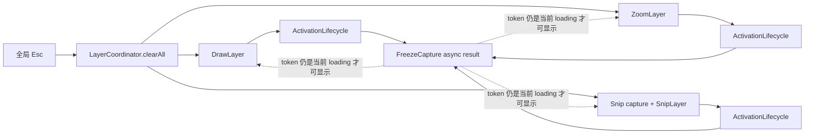
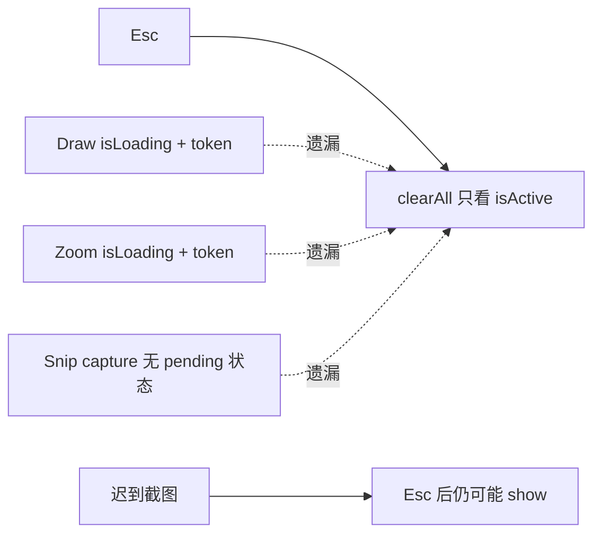
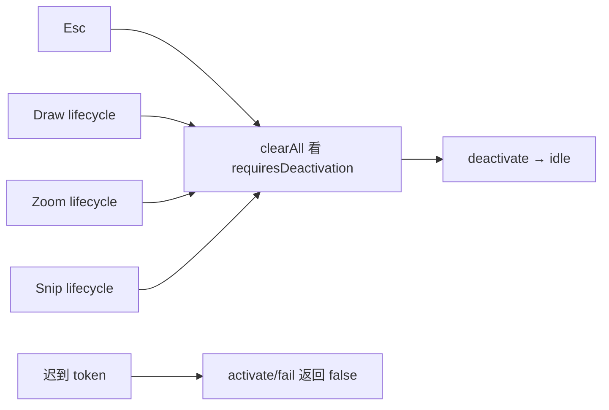

# Architecture Review: 异步层 Esc 取消闭环

## Verdict
上轮“核心状态已收紧”的方向正确，但结论不完整：真正跨层的复杂度中心是“pending 截图是否仍属于可清场状态”。Draw、Zoom、Snip 都曾在 loading 期间逃出 `clearAll`；本轮用一个小型 token 生命周期统一修复，而没有引入通用 Layer 或取消任务框架。

## Architecture Map

## Boundary
审查边界是 `HotkeyManager → LayerCoordinator.clearAll → Draw/Zoom/Snip pending capture → overlay show`。不审查媒体编码质量、像素级绘制、多显示器和发布系统。

## Review Lenses
- **生命周期正确性**：loading 不是“什么都没发生”，它拥有可取消的未来副作用。
- **边界与所有权**：各 Layer 管自己的激活状态；Snip pending capture 因组合跨层标注，由 Coordinator 所有。
- **信息隐藏**：调用方只问 `requiresDeactivation`，不需要理解 UUID/token 规则。
- **变化放大**：相同的 idle/loading/active 决定不应在三个入口重复实现。
- **错误边界**：迟到成功和迟到失败都应被定义为无效，而不是补偿性关窗或弹权限提示。
- **性能边界**：不修改截图、绘制热路径；任务结果只做常数时间 token 比较。

## Painful Center
代码原先已经在 Draw/Zoom 内部支持 loading 取消：两者的 `escape()` 都判断 `isActive || isLoading`。但 Coordinator 只在 `isActive` 时调用它们；Snip 在 capture 期间甚至没有 pending 状态。于是一次 Esc 的语义取决于截图是否恰好已返回，形成典型未知未知。

现在 `ActivationLifecycle` 统一拥有 token 与合法阶段（`Sources/InkLayer/ActivationLifecycle.swift:3`）；Draw、Zoom 分别通过它开始和完成 loading（`Sources/InkLayer/DrawLayer.swift:63`，`Sources/InkLayer/ZoomLayer.swift:41`）；Snip capture 也由 Coordinator 的同类状态保护（`Sources/InkLayer/LayerCoordinator.swift:191`）。`clearAll` 以 `requiresDeactivation` 判断 pending/active，而不再只看可见窗口（`Sources/InkLayer/LayerCoordinator.swift:216`）。

## Options

| 方案 | 边界清晰度 | 代码/迁移成本 | 迟到结果保护 | 性能风险 | 判决 |
|---|---|---:|---:|---:|---|
| A. 每层增加 `isActiveOrLoading` 并沿用三字段 | 中；修调用但保留三套规则 | 最低 | 仍靠每层手写 token | 无 | 可修 bug，但不消除根因 |
| B. 小型 `ActivationLifecycle` + 每入口一个值 | 高；状态知识集中、功能层仍独立 | 低 | 测试覆盖当前/过期 token | 常数时间比较 | **推荐，已实施** |
| C. 统一 cancellable Task/Actor capture service | 高，但 Coordinator/服务需理解所有 Layer payload | 高 | 可尝试物理取消 | 可能增加 hop；API 未必响应取消 | Prove first |

为什么不保持原状：Esc 后 overlay 回弹直接违反 PRD。为什么不只加布尔条件：它无法自动证明旧 token 失效，且继续复制三字段。为什么不把三个 Layer 合并：Draw 的 nil 截图会进入 live-glass，Zoom/Snip 的 nil 会失败，业务差异真实。为什么不立即取消底层 Task：ScreenCaptureKit 调用是否响应 Swift Task cancellation 没有证据；逻辑取消已经足以保证 UI 正确性。

## Findings

### P1: `clearAll` 漏掉 pending Draw/Zoom — Severity: High（已处理）
- **What I found**: Draw/Zoom 的 `escape()` 本来能取消 loading，但旧 Coordinator 只在 `isActive` 时调用。现在两层暴露 `requiresDeactivation`（`Sources/InkLayer/DrawLayer.swift:7`，`Sources/InkLayer/ZoomLayer.swift:7`），clearAll 对 pending 和 active 都调用 escape（`Sources/InkLayer/LayerCoordinator.swift:217`、`:226`、`:229`）。
- **APoSD principle**: 生命周期所有权 / 定义迟到结果无效。
- **Why it adds complexity**: *Unknown unknowns*；同一 Esc 会因异步时序不同而产生相反结果。
- **Recommendation**: 任何新增异步 overlay 必须在 pending 首刻进入 clearAll 可见的生命周期。
- **Why-not / tradeoff**:
  - 红队：Esc 只把状态设 idle，底层截图仍在消耗资源。
  - 蓝队：迟到结果必须携带旧 token，`activate(oldToken)` 失败，绝不会显示窗口。
  - 残余风险：物理 capture 可能继续到返回；只有 trace 证明资源浪费明显时再加 Task cancellation/timeout。

### P2: Snip capture 在 inactive 窗口前没有所有者 — Severity: High（已处理）
- **What I found**: 旧 `startSnip()` 只检查 `snip.isActive`，capture 期间重复 Ctrl+6 可再起任务，Esc 也看不到 pending。现在 `snipActivation.beginLoading()` 同时拒绝重复启动（`Sources/InkLayer/LayerCoordinator.swift:191`），成功/失败均校验当前 token（`:202`、`:207`），clearAll 可在窗口出现前取消（`:219`）。
- **APoSD principle**: 信息隐藏 / error defined out of existence。
- **Why it adds complexity**: 重复权限弹窗、重复截图，以及 Esc 后 Snip 回弹都来自“未来窗口”无人拥有。
- **Recommendation**: 保持 Snip pending capture 由 Coordinator 所有，因为它同时快照 Draw/Type 标注；窗口激活后由 SnipLayer 所有。
- **Why-not / tradeoff**: 不把 capture 全搬进 SnipLayer，否则 SnipLayer 必须反向知道 Draw/Type/Whiteboard/Zoom，依赖方向更差。

### P3: Draw/Zoom 重复编码三字段状态机 — Severity: Medium（已处理）
- **What I found**: 两层原本各有 `isActive`、`isLoading`、`activateToken` 与手写失效逻辑。现在各只持有一个 `ActivationLifecycle`（`Sources/InkLayer/DrawLayer.swift:7`，`Sources/InkLayer/ZoomLayer.swift:7`）。
- **APoSD principle**: 合并共享信息，而非合并功能。
- **Why it adds complexity**: 修一次取消规则必须找两个实现，且 Snip 很容易第三次重造。
- **Recommendation**: 只复用 token 生命周期；保留 Draw live-glass 与 Zoom denied 的业务分支。
- **Why-not / tradeoff**: 不抽象整个 Layer 接口；共享的是状态决定，不是窗口与权限行为。

### P4: 测试专用 `isLoading` 扩大生产 API — Severity: Low（已处理）
- **What I found**: 初版生命周期为测试增加了生产代码未使用的 `isLoading`。Razor 复查后删除，测试改为直接断言状态契约（`Tests/InkLayerTests/ActivationLifecycleTests.swift:9`、`:25`）。
- **APoSD principle**: YAGNI / 小接口。
- **Why it adds complexity**: 测试不应迫使生产类型暴露无消费者的便利 API。
- **Recommendation**: 保持 `isActive` 与 `requiresDeactivation` 仅服务真实调用者；状态测试通过 `state` 验证。
- **Why-not / tradeoff**: 状态本身就是此值对象的契约，测试它不是脆弱 UI 白盒测试。

### P5: capture 没有超时或物理取消 — Severity: Medium（Prove first）
- **What I found**: Draw、Zoom、Snip 都调用 `FreezeCapture.grab()` 并等待结果；token 只保证结果无效，不会停止底层工作（`Sources/InkLayer/DrawLayer.swift:65`，`Sources/InkLayer/ZoomLayer.swift:44`，`Sources/InkLayer/LayerCoordinator.swift:198`）。
- **APoSD principle**: 运行时生命周期 / 性能证据。
- **Why it adds complexity**: 若系统 API 真正挂起，层会停在 loading，直到用户 Esc；取消后后台工作仍可能继续。
- **Recommendation**: 先记录 capture duration 和超时样本；有真实长尾再设计 timeout/cancellable task。
- **Why-not / tradeoff**: 无 trace 时添加 task group/continuation 超时会扩大并发面，且不保证 ScreenCaptureKit 真能取消。

## Red / Blue Adversarial Review
- **红队攻击 1**：Esc 后立刻再次 Ctrl+2；旧截图比新截图晚回来并覆盖新层。
- **蓝队防御**：旧 token 与新一轮 `.loading(newToken)` 不相等，旧结果被拒绝；测试覆盖取消后迟到 completion。
- **红队攻击 2**：Snip capture 失败恰好发生在 Esc 后，仍弹权限框。
- **蓝队防御**：`fail(oldToken)` 返回 false 后直接 return，不记录 denied、不弹提示。
- **红队攻击 3**：为了统一继续增加通用 Layer 协议。
- **蓝队防御**：复用边界停在 `ActivationLifecycle`；Draw/Zoom/Snip 的 payload、nil 语义与窗口所有权保持具体。
- **残余风险**：底层 capture 不一定被物理取消；真实 UI 与资源占用仍需人检/trace。

## What Is Already Good
- `clearAll` 仍是唯一跨层 Esc 入口，没有把关闭顺序散回各 Layer。
- Draw 的 live-glass 降级、Zoom/Snip 的 denied 语义没有被“统一状态机”抹平。
- `ActivationLifecycle` 不依赖 AppKit/ScreenCaptureKit，可快速测试且没有运行时依赖。
- 录屏 `RecordingLifecycle` 与 overlay `ActivationLifecycle` 保持两个领域概念，没有为了复用强行泛化。

## Evidence Reviewed
- 完整读取并引用 `DrawLayer.swift`、`ZoomLayer.swift`、`LayerCoordinator.swift`、`RecordLayer.swift`、两个 lifecycle 和测试。
- 追踪搜索：`isLoading/isActive/activateToken/clearAll/escape/Task/onActiveChange` 全部写点与调用点。
- 复用 PRD `Esc 关闭所有层`、`方案.md` I2/I6 作为既有架构不变量。
- 基线（上轮完成后）：2 tests；约 2,035 行生产代码、28 行测试；debug 1,013,424 bytes；release 517,160 bytes。
- 结果：4 tests；约 2,067 行生产代码、60 行测试；debug 1,038,304 bytes；release 525,336 bytes；运行时依赖仍为 0。
- 未执行：真实 ScreenCaptureKit 权限/延迟、overlay 视觉、人机快速热键剧本；不冒充通过。

## Next Step
在打包 App 中分别执行 `Ctrl+1/2/6 → 立即 Esc → 等待 3 秒`，确认 overlay 不回弹；同时观察是否出现重复权限框。若 capture duration 有明显长尾，再开独立 timeout/cancellation 目标。

---

# Hai Razor: 异步激活概念

## Verdict
- **Verdict**: keep core / merge duplicated state / delete test-only API / prove cancellation first
- **One-line reason**: 保留三种功能差异，只合并它们真正共享的 token 生命周期。
- **Razor principle used**: 删除后若会重现 Esc 回弹或把 token 正确性推回调用方，就必须保留；只为统一外观或测试方便存在的概念则砍掉。

## Audit Scope
- **Chain / targets**: Draw/Zoom/Snip pending capture、Esc clearAll、候选通用抽象与取消机制
- **Current goal**: 异步层可取消、迟到结果不可复活
- **Not audited**: 录屏媒体正确性、画质、多屏、设置与发布

## Evidence

| Source | What was seen | Supports / weakens which verdict | Confidence |
|---|---|---|---|
| PRD + `方案.md` I2/I6 | Esc 全清、异步启动可取消是已声明不变量 | Keep explicit lifecycle | High |
| Draw/Zoom 旧字段与 guard | 相同三字段/token 决定重复 | Merge into lifecycle | High |
| Snip capture 调用链 | pending 窗口之前没有状态所有者 | Keep Coordinator-owned lifecycle | High |
| 测试 | 取消后旧 token、错误 token、重复 begin 被拒绝 | Keep lifecycle contract | High |
| capture trace | 没有延迟/资源数据 | Prove first physical cancellation | Low |

## Before / After

### Before

### After

## Razor Map

| Concept | Claimed purpose | What concretely breaks if deleted | Hidden owner | Verdict | Reason |
|---|---|---|---|---|---|
| Draw/Zoom/Snip 具体层 | 不同 payload、权限和窗口语义 | live-glass/denied/选区行为混乱 | 各功能 | Keep | 差异真实 |
| ActivationLifecycle | token、合法阶段、迟到结果拒绝 | Esc 回弹与重复启动复现 | 各异步入口 | Keep | 隐藏共享复杂度 |
| 每层三字段 | 表示同一激活状态 | 删除责任后仍需状态 | ActivationLifecycle | Replace | 责任真实，形状重复 |
| Snip lifecycle in Coordinator | 拥有跨层组合 capture | pending Snip 无人取消 | Coordinator | Keep | capture 本就由跨层编排发起 |
| `isLoading` 便利属性 | 方便测试读取 | 删除后无生产行为损失 | `state` | Delete | 仅测试使用 |
| 通用 Layer 协议 | 统一接口 | 删除后当前功能不受损 | 无 | Defer | 没有插件/替换压力 |
| 物理 Task cancellation | 减少取消后的资源工作 | 逻辑正确性不依赖它 | 待验证 | Prove first | 缺少性能与 API 可取消证据 |
| capture timeout | 避免永久 loading | 用户 Esc 已可恢复；真实挂起未证明 | 待验证 | Prove first | 先测长尾 |

## To Cut or Merge

| Concept | Action | Strongest survival argument | Why it still falls short |
|---|---|---|---|
| 三套布尔/token 状态 | Replace | 各 Layer 本地可读 | 同一规则修改三次且 Snip 已漏实现 |
| `isLoading` | Delete | 比枚举 pattern 更便利 | 没有生产消费者，为测试扩 API |
| 通用 Layer 协议 | Defer | 可统一 `isActive/escape` | 无法统一 payload/nil/权限语义 |
| Task cancellation/timeout | Prove first | 可能节省资源、避免卡死 | 无 trace，且底层 API 未必响应 |

## Complexity To Preserve

| Concept | Why preserved | Boundary that must not be mis-cut |
|---|---|---|
| Token identity | 阻止旧异步结果复活 | 不用单纯 Bool 替代 |
| Draw live-glass | 无权限仍能圈画 | 不与 Zoom/Snip denied 合并 |
| Snip capture in Coordinator | 需要快照其他层的矢量数据 | 不让 SnipLayer 反向依赖全部层 |
| 逻辑取消 | 即使底层任务不停也保证 UI 正确 | 不把资源取消当 correctness 前提 |

## Shape After the Razor
三个功能模块仍独立；共享部分只有 39 行纯生命周期值。Coordinator 多持有一个 Snip 生命周期，用它拒绝重复 capture 并让 Esc 看见 pending。没有协议层、服务层、Actor 或第三方依赖。

## Risks & Guardrails
- **Likely rebound**: 新异步层再次只暴露 `isActive`，忘记 pending。
- **Mis-cut risk**: 用 Bool 代替 token，导致取消后新旧任务无法区分。
- **Guardrails**: 新异步 overlay 必须使用 tested lifecycle 或证明等价；测试保留旧 token/错误 token/重复 begin 三种攻击。

## Next Steps
执行 UI 人检；capture 长尾与物理取消列为 Prove first。聚焦审查不生成 HTML，因为新增可视化不会增加证据。

---

# Clean Code Review: 异步激活路径

## Summary
最高杠杆坏味道不是函数长度，而是 Draw/Zoom 重复的三字段状态机与 Snip 缺失同类状态。已通过共享值对象消除；同时删除仅为测试存在的便利 API。

## Findings

### P1: 三份异步状态决定不一致（已处理）
- **原则**: DRY / 结构清晰度
- **位置**: `Sources/InkLayer/ActivationLifecycle.swift:3`
- **级别**: 高
- **问题**: Draw/Zoom 重复实现、Snip 漏实现，使 Esc 语义受时序影响。
- **建议**: 保持 token 生命周期为唯一共享决定。
- **Why now**: 直接破坏核心清场行为。

### P2: `clearAll` 用可见状态代替可取消状态（已处理）
- **原则**: 命名 / 结构清晰度
- **位置**: `Sources/InkLayer/LayerCoordinator.swift:216`
- **级别**: 高
- **问题**: `isActive` 回答“是否可见”，不能回答“是否仍有未来副作用”。
- **建议**: 继续使用 `requiresDeactivation`。
- **Why now**: pending 是异步 UI 的真实状态，不是实现细节。

### P3: 测试专用生产属性（已处理）
- **原则**: YAGNI
- **位置**: `Tests/InkLayerTests/ActivationLifecycleTests.swift:9`
- **级别**: 低
- **问题**: 初版 `isLoading` 没有生产消费者。
- **建议**: 测试状态契约，不扩生产 API。
- **Why now**: 轻量化应约束测试代码同样不能制造抽象。

## Good Patterns To Keep
- Layer 业务差异具体化，token 规则集中化。
- guard clause 让迟到成功/失败立即退出。
- clearAll 仍拥有跨层关闭顺序。

## Test Gaps
- AppKit 集成层尚无可注入 capture，因此 Coordinator 的 wiring 由源码检查与人检兜底。
- ScreenCaptureKit 是否响应 Task cancellation、长尾多长，尚无 trace。

---

# Hai TDD: 异步激活取消

## Target Behavior
只有当前 loading token 能完成或失败；取消后，迟到 token 永远不能进入 active；loading/active 都要求 clearAll 处理。

## RED
- **Test added**: `Tests/InkLayerTests/ActivationLifecycleTests.swift`
- **Behavior asserted**: 取消后拒绝迟到 completion、错误 token 不改变状态、重复 begin 被拒绝
- **Command**: `swift test --filter ActivationLifecycleTests`
- **Observed failure**: `cannot find 'ActivationLifecycle' in scope`
- **Failure is correct because**: 测试目标和旧生产代码正常编译，唯一缺失正是待实现的共享状态模型。

## GREEN
- **Minimal implementation**: 新增 idle/loading(token)/active 三态、begin/activate/fail/deactivate 四个转换。
- **Command**: `swift test --filter ActivationLifecycleTests`
- **Observed pass**: 2 tests，0 failures。

## REFACTOR
- **Refactor done**: yes
- **Change**: Draw/Zoom 删除各自三字段；Snip capture 加入同一 token 守卫；clearAll 覆盖 pending；删除测试专用 `isLoading`。
- **Command after refactor**: `swift test -Xswiftc -warnings-as-errors`；`swift build -c release -Xswiftc -warnings-as-errors`
- **Observed result**: 4 tests，0 failures；release build 通过，无警告。

## Next Behavior
自动化状态切片完成；下一步是 Ctrl+1/2/6 后立即 Esc 的真实 UI 人检。
