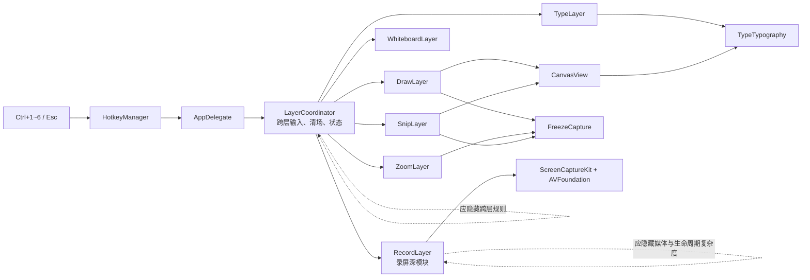
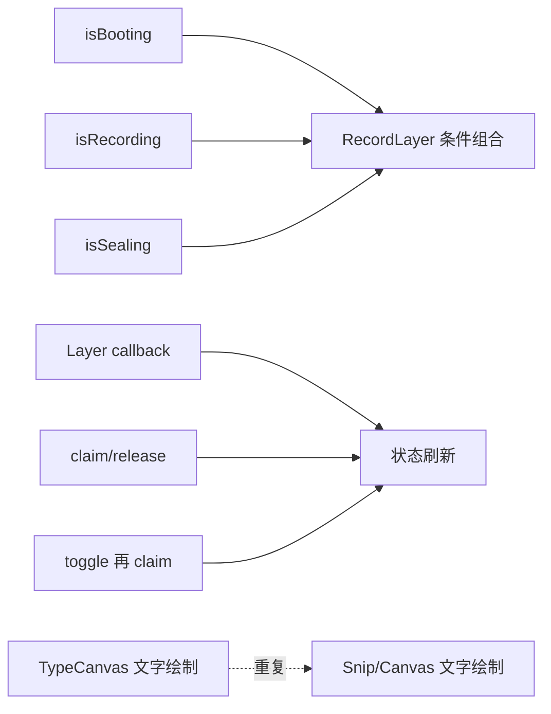
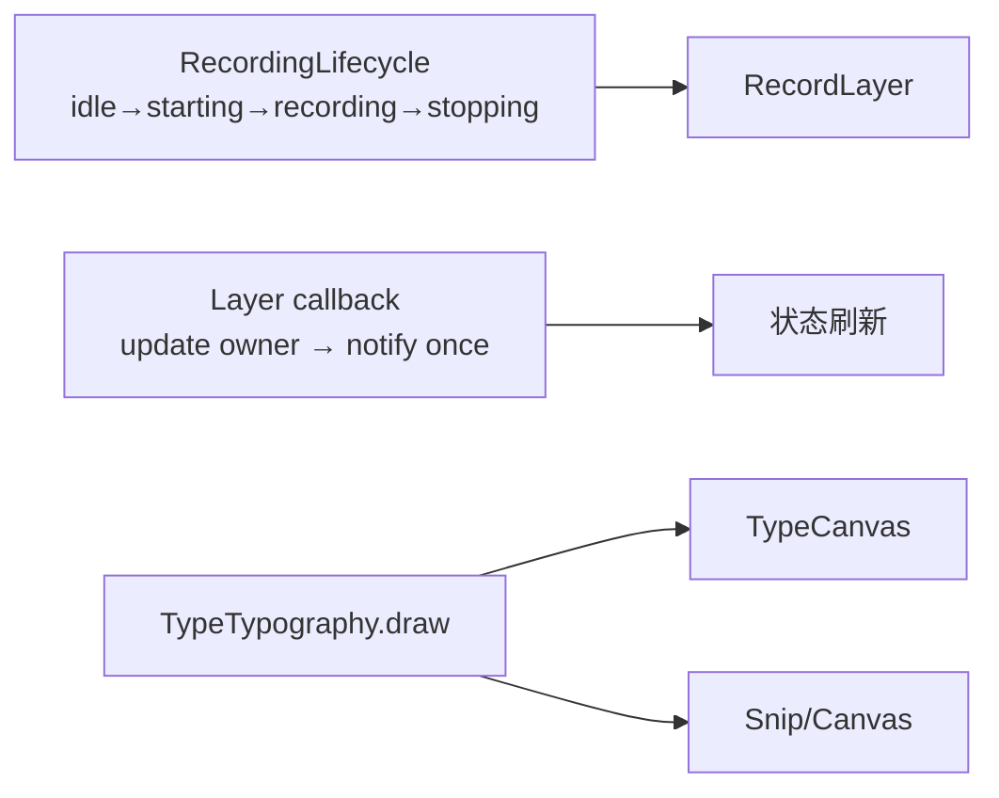

# Architecture Review: InkLayer 轻量化

> 后续对抗复查发现并修复了 Draw / Zoom / Snip pending capture 未被 Esc 清场的问题；最新结论与证据见 `docs/adversarial-optimization-review.md`。本文保留为上一轮历史基线。

## Verdict
当前六层架构与产品边界基本匹配，不该做“大一统 Layer 协议/共享画布”重写。最值得修的是录屏生命周期的隐式布尔组合；推荐并已实施“保留具体层 + 单一录屏状态机 + 局部去重”，以很小的代码增量换取更强的不变量和测试面。

## Architecture Map

## Boundary
本轮审查 `AppDelegate → LayerCoordinator → 六个具体层` 的编排边界，以及 `RecordLayer` 对录屏生命周期的内部所有权。媒体编码参数、ScreenCaptureKit 帧处理、多显示器、发布与设置系统不在重构范围。

## Review Lenses
- **边界与所有权**：跨层输入由 Coordinator 所有，录屏阶段由 RecordLayer 所有，不能散回调用方。
- **模块深度与信息隐藏**：保留 RecordLayer 的小外部接口，不因文件长就拆成多层透传对象。
- **变化放大**：重点检查同一状态/渲染决定是否编码在多个位置。
- **认知负荷与显然性**：录屏应一眼看出只能处于一个阶段。
- **测试与验证面**：优先为纯状态不变量建测试，不用脆弱 UI mock 冒充真实媒体验证。
- **性能边界**：不改帧写入、截图与绘制循环；无证据时不把同步遥测改成可能丢尾事件的异步写入。

## Painful Center
痛点不是六个 Layer 类太多，而是录屏阶段曾由三个可组合布尔值表达，同时跨越启动 Task、主线程和 I/O 队列。调用者必须在脑中排除无意义组合。现在 `RecordingLifecycle` 把合法阶段收束为四态，`RecordLayer` 只根据单一状态响应 toggle、start、stop 和 teardown（`Sources/InkLayer/RecordingLifecycle.swift:1`，`Sources/InkLayer/RecordLayer.swift:9`）。

## Options

| 方案 | 边界清晰度 | 当前需求匹配 | 迁移成本 | 性能风险 | 判决 |
|---|---|---:|---:|---:|---|
| A. 只删死代码与重复行 | 低；不解决隐式生命周期 | 中 | 最低 | 无 | 过于保守 |
| B. 保留六层，加入单一生命周期并局部去重 | 高；复杂度仍由现有深模块吸收 | 高 | 低 | 无热路径变化 | **推荐，已实施** |
| C. 通用 Layer 协议 + 共享画布 + Actor 媒体服务 | 表面统一，但增加协议、适配与跨 Actor 排序 | 低；六层固定且无插件需求 | 高 | 可能增加 hop 与迁移回归 | 延后，先证明 |

为什么不维持原状：布尔组合允许非法阶段，且无自动化契约。为什么不继续细拆 RecordLayer：capture、writer、ticker 的正确顺序共享大量生命周期知识，拆开会把顺序暴露成跨模块协议。为什么不合并到 Coordinator：会把媒体细节泄漏进跨层编排。为什么不做通用 `Layer`：六层的输入、权限和状态语义并不同，统一接口会成为浅抽象。

## Findings

### P1: 录屏生命周期由单一所有者表达 — Severity: High（已处理）
- **What I found**: 当前四态与合法转换集中在 `Sources/InkLayer/RecordingLifecycle.swift:1`；`RecordLayer` 的 toggle 只对 idle/recording 行动，starting/stopping 明确忽略（`Sources/InkLayer/RecordLayer.swift:28`），启动、成功、停止和清理分别调用同一状态对象（`Sources/InkLayer/RecordLayer.swift:48`、`:179`、`:209`、`:277`）。
- **APoSD principle**: 信息隐藏 / 定义非法状态不存在。
- **Why it adds complexity**: 原布尔组合要求读者自行推导合法组合，形成未知未知与竞态入口。
- **Recommendation**: 保持四态为唯一生命周期源，不重新添加旁路布尔值。
- **Why-not / tradeoff**:
  - 红队：未来直接调用 `didFinish()` 可跳过正常停止。
  - 蓝队：`requestStart` / `didStart` / `requestStop` 拒绝非法阶段，测试覆盖重复启动、重复停止和跨阶段完成。
  - 残余风险：`didFinish()` 刻意允许失败/取消从任意阶段回 idle；资源清理是否完整仍由真实录屏人检确认。

### P2: 跨层状态刷新存在重复路径 — Severity: Medium（已处理）
- **What I found**: 层回调现在先 claim/release 输入，再各自只通知一次（`Sources/InkLayer/LayerCoordinator.swift:47`、`:58`、`:70`、`:81`）；`claimInput` 和 `releaseInput` 只负责归属，不再隐式刷新 UI（`:97`、`:109`）。Snip 关闭后的焦点归还也并入 active=false 回调。
- **APoSD principle**: 一个决定一个所有者；减少变化放大。
- **Why it adds complexity**: 同一次激活经过 layer callback、claim 和 toggle 三条通知路径，会重复 makeKey/刷新菜单栏，且难判断哪条才是规范路径。
- **Recommendation**: 状态回调保持“更新归属 → 通知一次”的顺序。
- **Why-not / tradeoff**: 不把所有层改成协议，因为它们的激活副作用并不一致；当前显式接线更容易审计。

### P3: 屏幕文字与 Snip 文字编码同一绘制决定 — Severity: Medium（已处理）
- **What I found**: 文字属性、测量与绘制选项集中在 `TypeTypography.draw`（`Sources/InkLayer/TypeLayer.swift:291`）；打字画布与 Snip 预览分别只调用它（`Sources/InkLayer/TypeLayer.swift:339`，`Sources/InkLayer/CanvasView.swift:79`）。
- **APoSD principle**: 消除信息泄漏。
- **Why it adds complexity**: 两份实现可能独立漂移，使屏幕所见与剪贴板结果不一致。
- **Recommendation**: 后续文字布局修复只改 `TypeTypography`。
- **Why-not / tradeoff**: 不抽象整个绘制引擎；只有 TextStamp 决策真实重复，Stroke 路径仍由 CanvasView 独占。

### P4: `@unchecked Sendable` 下的媒体资源跨执行器访问尚未被证明安全 — Severity: Medium（待证）
- **What I found**: `RecordLayer` 声明 `@unchecked Sendable`（`Sources/InkLayer/RecordLayer.swift:8`）；资源在异步 boot 中装配（`:161`），帧在专用 `ioQueue` 消费（`:24`、`:285`），生命周期回调主要回主线程。
- **APoSD principle**: 并发所有权与未知未知。
- **Why it adds complexity**: 编译器被要求信任人工隔离，但当前没有 Thread Sanitizer 或严格并发证据。
- **Recommendation**: 先用 Thread Sanitizer 跑开始/停止/快速重录剧本；只有出现竞态或 Swift 6 严格并发阻塞时，才把媒体资源整体移入一个 Actor/串行执行器。
- **Why-not / tradeoff**: 立即 Actor 化会改动 ScreenCaptureKit delegate 与 AVAssetWriter 热路径，证据不足，不符合本轮轻量化边界。

## Red / Blue Check
- **红队攻击**：将所有 Layer 统一成协议后，开发者会把权限、焦点、异步加载等差异塞进可选方法或 capability flag，抽象表面更整齐、调用协议更复杂。
- **蓝队防守**：保留六个具体层；只把真实共享决定（InputOwner、TextStamp 绘制、录屏状态）集中起来。
- **残余风险**：层数量若继续增长，`wireLayers()` 会线性扩张。触发器应是“新增一个层必须改 4+ 处且规则雷同”，而不是当前文件行数。

## What Is Already Good
- `LayerCoordinator` 隔离跨层协作，`AppDelegate` 只接热键和菜单。
- `RecordLayer` 对外接口很小，内部隐藏 ScreenCaptureKit、AVAssetWriter、麦克风和通知复杂度，是深模块而非应拆的大类。
- `CanvasView` 被 Draw 与 Snip 复用，保证矢量笔画合成路径一致。
- 零第三方运行时依赖；PRD 明确砍掉的多屏和设置 UI 没有偷跑进架构。

## Evidence Reviewed
- 完整读取 20 个生产 Swift 文件、`Package.swift`、PRD、`GOAL.md`、`方案.md`、遥测文档和打包脚本。
- 运行搜索：状态布尔值与所有写点、`claimInput/releaseInput/onStatusChange` 调用、TextStamp 绘制、Application Support 路径、异步/事件 API。
- 基线：`swift build` 通过；`swift test` 报 “no tests found”；约 2,026 行非空/非整行注释生产代码，debug 二进制 1,011,152 bytes。
- 结果：`swift test` 2/2 通过；warnings-as-errors 的 release build 通过；约 2,035 行生产代码 + 28 行测试，debug 二进制 1,013,424 bytes，release 二进制 517,160 bytes；运行时依赖仍为 0。
- 限制：没有自动操作 ScreenCaptureKit 权限、真实麦克风、中文 IME 或视觉像素比对；这些结论不冒充人检通过。

## Next Step
用打包后的 App 人检四个高价值剧本：开始→停止、停止后立刻再开、圈画+打字切焦点、带中文烙字的 Snip；若无回归，本轮收口。若 Thread Sanitizer 报告媒体竞态，再单独立 Actor 化目标。

---

# Hai Razor: 六层架构与新增抽象

## Verdict
- **Verdict**: keep core / merge some / defer some / replace current shape
- **One-line reason**: 保留承载真实产品差异的六个具体层，只替换非法布尔组合、合并重复决定、删除无责任的回调和字段。
- **Razor principle used**: 删除后若不破坏用户目标、不移走必要风险、且现有所有者能吸收责任，就不值得独立存在。

## Audit Scope
- **Chain / targets**: AppDelegate → Coordinator → 六层；录屏状态；跨层通知；TextStamp 绘制；候选通用抽象
- **Current goal**: 在不改变质量与性能路径的前提下减少认知负荷
- **Not audited**: 产品需求取舍、媒体编码质量、多显示器、发布基础设施、像素级视觉设计

## Evidence

| Source | What was seen | Supports / weakens which verdict | Confidence |
|---|---|---|---|
| PRD §5/§11 | 六件套固定、AppKit/macOS 14+、至多一个依赖 | Keep concrete layers；Defer plugin protocol | High |
| `LayerCoordinator.swift` | 跨层焦点、Esc、Snip、状态聚合真实存在 | Keep Coordinator/InputOwner；Merge notification paths | High |
| `RecordLayer.swift` | capture/writer/UI 共享严格生命周期 | Keep deep module；Replace boolean state shape | High |
| `CanvasView.swift` + `TypeLayer.swift` | TextStamp 同时出现在屏幕与 Snip | Merge rendering decision | High |
| 现有测试/trace | 原来无测试；没有竞态或 telemetry 卡顿数据 | Prove first Actor/async telemetry | Medium |

## Before / After

### Before

### After

## Razor Map

| Concept | Claimed purpose | What concretely breaks if deleted | Hidden owner | Verdict | Reason |
|---|---|---|---|---|---|
| 六个具体 Layer | 六种不同窗口/权限/输入语义 | 热键功能与独立叠加失效 | 各功能自身 | Keep | 差异真实，不是文件装饰 |
| LayerCoordinator | 跨层焦点、Esc、Snip 与状态聚合 | 规则散回 AppDelegate 和各层 | Coordinator | Keep | 小接口隐藏跨层复杂度 |
| InputOwner | 多窗口下快捷键路由 | Ctrl+Z/换色再次依赖 key window | Coordinator | Keep | 保护已知不变量 |
| 三个录屏布尔值 | 表示启动/录制/封装 | 删除责任后仍需阶段模型 | RecordingLifecycle | Replace | 责任真实，形状错误 |
| RecordingLifecycle | 阻止非法阶段组合 | 重回人工推导组合 | RecordLayer | Keep | 类型直接保护不变量 |
| Snip `onFinish` | 关闭后归还焦点 | active=false 回调已能完成 | `onActiveChange(false)` | Delete | 独立回调不再拥有独特决定 |
| `keyMonitor` 字段 | 预留键盘 monitor | 当前从未安装任何对象 | 无 | Delete | 假想未来需求 |
| 两份 TextStamp 绘制 | 各视图局部自足 | 删除一份不破坏功能 | TypeTypography | Merge | 同一视觉决定应有一个所有者 |
| 通用 Layer 协议 | 统一六层接口 | 当前不实现也无功能损失 | 无 | Defer | 尚无真实替换/插件压力 |
| 共享巨型 Overlay 画布 | 减少窗口数量 | 当前窗口语义、层级和输入隔离会丢失 | 无合适所有者 | Defer | “文件/窗口更少”不等于复杂度更少 |
| Actor 化录屏 | 编译器验证并发所有权 | 当前无竞态证据，重写成本高 | 待验证 | Prove first | 先用 TSan/严格并发取证 |
| Telemetry 异步批写 | 减少同步 I/O | 可能丢最后事件；无卡顿 trace | 待验证 | Prove first | 性能收益未被证明 |

## To Cut or Merge

| Concept | Action | Strongest survival argument | Why it still falls short |
|---|---|---|---|
| Snip `onFinish` | Delete | 能保证 close 完成后再归还焦点 | active=false 已在 close 后触发，能按正确顺序承担 |
| `keyMonitor` | Delete | 未来可能恢复本地键盘监听 | 当前统一路由已明确归 Coordinator，预留字段只制造假路径 |
| TextStamp 双实现 | Merge | 每个 View 局部阅读更直接 | 会让屏幕与剪贴板结果漂移，破坏“所见即所得” |
| 重复 claim/status 通知 | Merge | 多处通知似乎更保险 | 没有增加正确性，只增加重复焦点与 UI 工作 |
| 通用 Layer/共享画布 | Defer | API 统一、窗口更少 | 没有扩展需求证据，且会抹平真实差异 |

## Complexity To Preserve

| Concept | Why preserved | Boundary that must not be mis-cut |
|---|---|---|
| 具体 Layer 类 | 各自封装窗口、权限、输入和异步加载 | 不把差异塞进可选协议方法 |
| RecordLayer 媒体管线 | 捕获、编码、音频和收尾必须严格排序 | 不按“读/处理/写”做时间分解 |
| InputOwner | 多窗口只允许一个键盘语义所有者 | 不退回 key window 猜测 |
| 同步 Telemetry | 当前保证调用返回时事件已追加 | 无性能证据前不牺牲尾事件耐久性 |

## Shape After the Razor
架构仍是 AppDelegate + 一个 Coordinator + 六个具体深模块。新增的唯一生产概念是 32 行纯生命周期值；同时删掉重复通知、重复绘制和无效回调/字段。没有新增第三方依赖、运行时服务层、协议层或媒体 hop。

## Risks & Guardrails
- **Likely rebound**: 为“统一”重新引入 Layer 协议，或在 RecordLayer 旁添加新的状态布尔值。
- **Mis-cut risk**: 把 RecordLayer 按步骤拆散，导致媒体资源与状态排序泄漏。
- **Guardrails**: 生命周期单测；新增阶段必须先扩测试；任何 Actor/Telemetry 优化先提供 TSan 或 trace 证据；Snip 与屏幕文字始终调用同一绘制入口。

## Next Steps
本轮切单已执行。待证项只有真实录屏/IME/视觉人检，以及有证据后再决定 Actor 和异步遥测。

## HTML Artifact
未生成：这是围绕三个已确认热点的聚焦审查，不是用户要求的全量可视化审计；HTML 会增加交付仪式而不增加判断证据。

---

# Clean Code Review: 本轮优化范围

## Summary
最高杠杆风险是用多个布尔值表达互斥生命周期，其次是同一状态刷新和文字绘制决定存在多条实现路径。本轮已在不改变功能的前提下处理；剩余主要风险是媒体对象的并发隔离尚无工具证据。

## Findings

### P1: 互斥生命周期由布尔组合表达（已处理）
- **原则**: 结构清晰度 / 单一职责
- **位置**: `Sources/InkLayer/RecordLayer.swift:9`
- **级别**: 高
- **问题**: 多布尔值能形成无意义组合，读者需人工推导状态。
- **建议**: 使用已加入的 `RecordingLifecycle` 作为唯一状态源。
- **Why now**: start/stop/seal 是录屏可用性的核心，非法重入代价高。

### P2: 同一文字渲染规则重复（已处理）
- **原则**: DRY
- **位置**: `Sources/InkLayer/TypeLayer.swift:302`
- **级别**: 中
- **问题**: 屏幕与 Snip 的文字结果可能独立漂移。
- **建议**: 继续共用 `TypeTypography.draw`。
- **Why now**: 这是 Snip “所见即所得”不变量。

### P3: 状态通知和焦点 claim 重复（已处理）
- **原则**: DRY / 结构清晰度
- **位置**: `Sources/InkLayer/LayerCoordinator.swift:47`
- **级别**: 中
- **问题**: 一次层变化可触发多次菜单刷新和 focus 调用。
- **建议**: 保持单一 callback 顺序。
- **Why now**: 多层同开是已知高频故障面。

### P4: 媒体并发隔离依赖人工保证（待证）
- **原则**: 结构清晰度
- **位置**: `Sources/InkLayer/RecordLayer.swift:8`
- **级别**: 中
- **问题**: `@unchecked Sendable` 关闭了一部分编译器保护。
- **建议**: 先以 TSan/严格并发诊断取证，再做行为保持型隔离重构。
- **Why now**: 不能凭直觉重写热路径，也不能长期把 unchecked 当证明。

## Good Patterns To Keep
- Coordinator 只处理跨层规则，各层封装自身 AppKit 行为。
- RecordLayer 以小接口隐藏复杂媒体实现。
- CanvasView 被实时圈画和 Snip 预览复用。
- 常量、调色板、图像方向和 Retina 位图已有集中所有者。

## Test Gaps
- 真实 ScreenCaptureKit + 麦克风开始/停止/重录。
- IME 标记文本下的 Enter、Esc、Ctrl+Z。
- Snip 与屏幕文字的像素级一致性。
- TSan 下的快速开始/停止压力剧本。

---

# Hai TDD: 录屏生命周期

## Target Behavior
录屏只允许 `idle → starting → recording → stopping → idle`；重复启动、跳过启动完成、空闲停止和重复停止都不改变状态。

## RED
- **Test added**: `Tests/InkLayerTests/RecordingLifecycleTests.swift`
- **Behavior asserted**: 合法四态与非法转换拒绝
- **Command**: `swift test --filter RecordingLifecycleTests`
- **Observed failure**: `cannot find 'RecordingLifecycle' in scope`
- **Failure is correct because**: 测试目标成功编译到测试文件，唯一缺失正是尚未实现的生产状态模型。

## GREEN
- **Minimal implementation**: 新增 32 行 `RecordingLifecycle`，只包含四态和四个转换方法。
- **Command**: `swift test --filter RecordingLifecycleTests`
- **Observed pass**: 2 tests，0 failures。

## REFACTOR
- **Refactor done**: yes
- **Change**: 接入 RecordLayer；删除三布尔值、重复通知/claim、Snip 完成回调、无效 key monitor；合并 TextStamp 绘制。
- **Command after refactor**: `swift test`；`swift build -c release -Xswiftc -warnings-as-errors`
- **Observed result**: 2 tests 全过；release build 通过且无警告。

## Next Behavior
自动化切片完成；下一步是用户环境中的真实录屏、IME 与 Snip 视觉人检。
